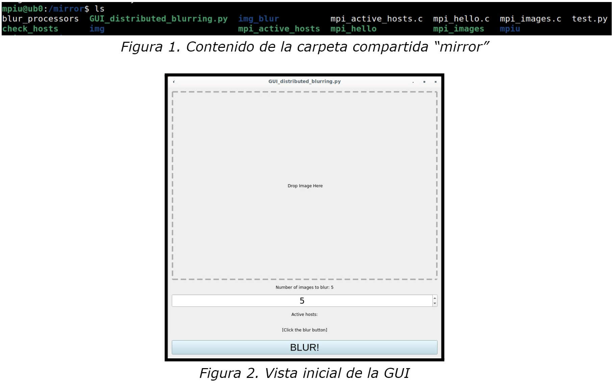
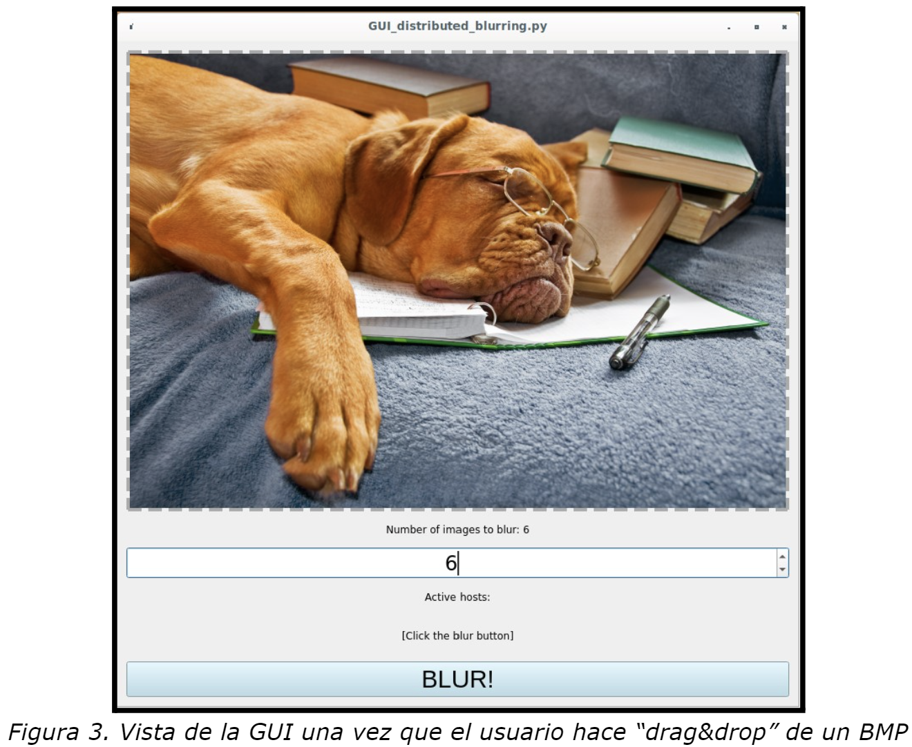
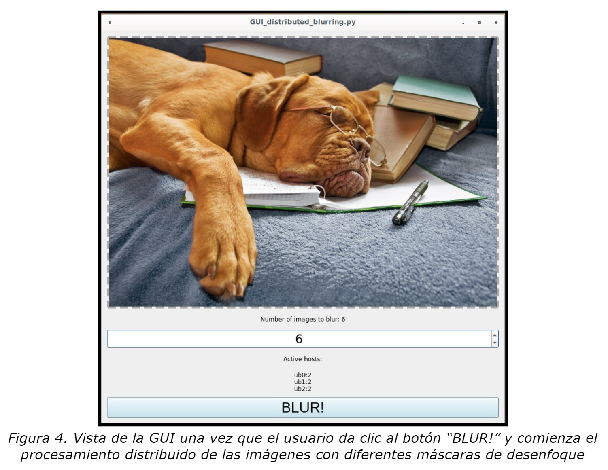
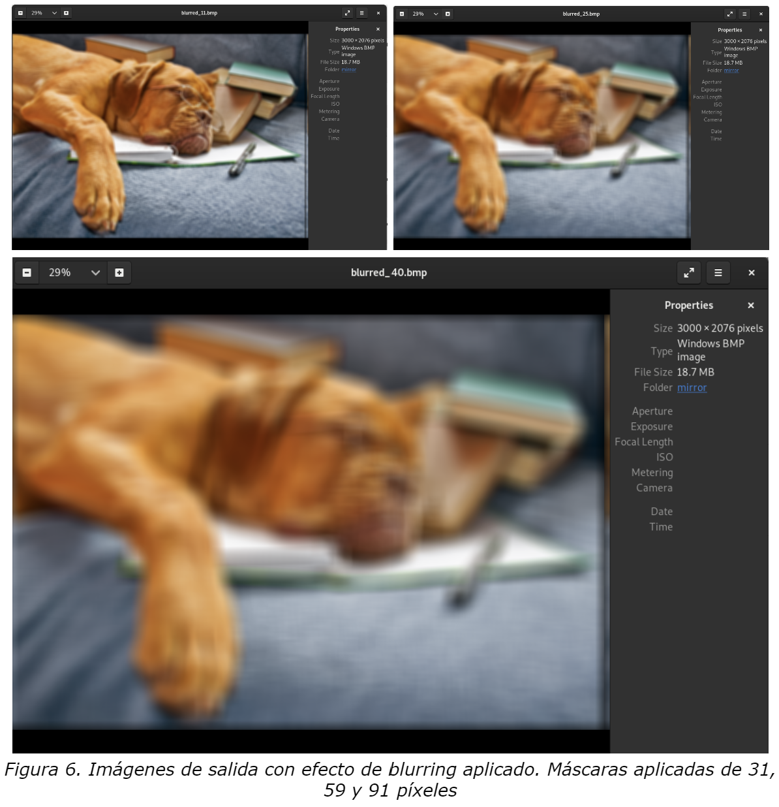
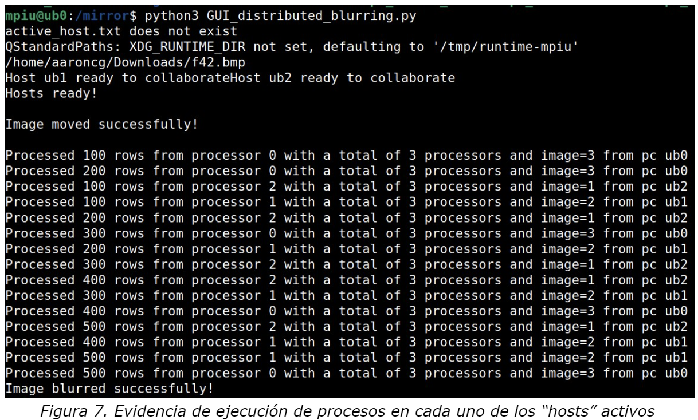

# Reporte de actividad

### GUI PROCESAMIENTO DISTRIBUIDO

**Alumnos:**
- Aarón Cortés García - A01730451
- Daniel Esteban Maldonado Espitia - A01657967
- Ezequiel Lozano Guerrero - A01734172

--- 

## 1. Descripción

El presente ejercicio de procesamiento distribuido, contempla la creación de una interfaz gráfica implementada en PyQt5, la cual permita la transformación de una imagen en formato BMP para aplicar hasta 50 convoluciones de desenfoque o efecto blurring con máscaras de diferentes tamaños, mismas que son trabajadas por diferentes máquinas a través de una carpeta compartida MPI en una red local.

Las herramientas que se emplearán serán: un script Python el cual hace uso de PyQt5 para generar la interfaz gráfica, otro script en C que utiliza la librería de Message Passing Interface (MPI), una imagen BMP (bitmap) de alta resolución (3000 x 2076), 3 PCs para colaborar en el procesamiento y un switch para lograr la interconexión entre estos dispositivos.

La aplicación de interfaz gráfica se ejecutará como una aplicación de escritorio. Esta debe contar con un campo que permita arrastrar y soltar la imagen, así como otro campo para indicar la cantidad de imágenes con máscaras diferentes que se deben generar. Además, debe incluir un cuadro de diálogo que muestre los hosts o nodos disponibles para realizar el procesamiento distribuido, junto con un botón que active la acción de desenfoque de las imágenes.

El efecto de blurring se desea obtener por medio de la técnica “weighted average filter”, utilizando máscaras o kernels con un tamaño determinado, para visitar los vecinos que se encuentran alrededor de cada pixel, realizar una ponderación promedio de los colores y escribir el valor resultante en una nueva imagen de salida. Se espera que, entre más vaya creciendo la máscara, el efecto blurring sea más notorio debido a la influencia de píxeles más externos. Además, gracias a la intervención de múltiples máquinas, se estima que el tiempo de ejecución total presente una reducción sustancial respecto a la que se obtendría usando una sola PC, pero aún así manteniéndose considerablemente tardado debido a la alta resolución del BMP y la aplicación de los kernels más grandes.

## 2. Metodología

La solución propone el diseño de una interfaz simple a través de PyQt5, que contenga un espacio designado para poder realizar el drag and drop de cualquier imagen en formato BMP, además, un SpinBox para poder determinar el número de imágenes a procesar con distintas máscaras, un botón para poder iniciar el proceso de distribución y creación de las imágenes desenfocadas y finalmente diferentes labels para especificarle al usuario de qué se trata cada apartado en la GUI. 

A partir de la interfaz, es posible establecer y conectar diversas funciones con cada elemento y acción del usuario. Una vez arrastrado algún BMP a la ventana y dado clic al botón “BLUR!”, primeramente se necesita identificar cuáles de los hosts esperados a la red local se encuentran realmente conectados, esto para evitar la asignación de procesos a máquinas no presentes y eventualmente el fallo del procesamiento en las imágenes. La anterior comprobación es posible al usar un código de testing, que solicite de forma secuencial (uno por uno) la creación de un archivo a cada máquina de la red y deteniendo la ejecución de esa instrucción después de unos pocos segundos, por lo tanto, si algún nodo no se encuentra conectado, fallará en la tarea solicitada, y por lo consiguiente, será ignorado para el procesamiento de desenfoque de las imágenes.

Una vez identificados los active hosts, el mismo código en Python puede realizar una repartición equitativa entre todas las máquinas disponibles, reconociendo el número de imágenes indicadas por el usuario y transportando esa asignación al archivo de entrada que guiará la ejecución distribuida del código. Hecho esto, es necesario copiar la imagen original presente en la interfaz hacia la carpeta “mirror” compartida por todos los hosts, permitiéndoles hacer una lectura de la misma para conseguir el procesamiento de desenfoque deseado. 

Después, solo resta hacer la compilación del código en C presentado en la actividad anterior, que implementa la ejecución distribuida con MPICH, haciendo en cada proceso una lectura secuencial del BMP original, para copiar su header en una nueva imagen abierta en modo de escritura, y posteriormente visitar todos los píxeles propios del archivo, logrando realizar la ponderación de los colores encerrados por la máscara indicada y completando el efecto de blurring.

Al analizar la estructura y pasos del procesamiento, se puede identificar con claridad que las entradas del programa son los inputs del usuario en la GUI (archivo BMP original, número de imágenes a procesar con distintas máscaras y clic del botón de acción), así como el número de procesos indicados para cada nodo de la red después de hacer la comprobación de conexión. Mientras que las salidas son diferentes BMPs alojados en la carpeta compartida, con un nivel de blurring distinto en cada uno respecto a la imagen original. 

## 3. Resultados

Después de haber cargado la imagen en la interfaz gráfica y haber comprobado que existe una conexión exitosa entre las 3 máquinas del cluster, se realizó la prueba de desenfocar la imagen del perrito con 50 máscaras diferentes. El tiempo de ejecución en las 3 máquinas virtuales que usan Linux (Debian), a las cuales se les asignó 2 procesadores y 2 GB de RAM a cada una, fue de 40 minutos, presentando tiempos de procesamiento adecuados o similares a los esperados, sobretodo en las aplicaciones de las máscaras más grandes. 

Una vez ejecutado el código, se obtuvieron las 50 imágenes en formato BMP esperadas, con un nivel de blurring cada vez más notorio de acuerdo al kernel aplicado para hacer la ponderación de color. Como resultado de la estrategia “zero padding”, las imágenes con las máscaras más grandes presentan un borde pequeño, pero notablemente más oscuro que el resto de la escena. 

## 4. Conclusiones

Distribuir el procesamiento de un programa entre una red de nodos optimiza en absoluto la velocidad de procesamiento de una o más tareas. La primicia de dicha aseveración es esencialmente las fases por las que esta tarea fue sometida, donde, en un comienzo el software de difuminación de una imagen se desarrolló de tal forma que su ejecución se llevaba a cabo por una sola máquina, sin embargo, al aplicarse máscaras grandes el tiempo de procesamiento era grande. Cuando pasamos a la segunda fase distribuimos las tareas entre tres máquinas Linux, acción que mejoró la eficiencia de la difuminación, pero no del todo, ya que, los recursos asignados a las máquinas virtuales de Linux no eran equitativos (debido a que en un inicio no acordamos como equipo darle el mismo número de núcleos, RAM ni almacenamiento). Finalmente, en la tercera fase implementamos una interfaz gráfica para que el usuario tenga la posibilidad de arrastrar la imagen que desea difuminar, así como elegir el número de máscaras a aplicar; al momento de que el usuario da clic en el botón y comienza el procesamiento, interamente lo que hace el programa es copiar la imagen elegida a una carpeta compartida entre las tres máquinas para que se distribuya el procesamiento, pero esta vez de manera equitativa (ya contando las computadoras con los mismos recursos asignados), lo cual genera una eficiencia impresionante en comparación con las dos anteriores fases del proyecto. Asimismo, en pantalla se despliega qué nodos son los que trabajarán con la imagen, además se genera un mensaje cuando se hace una copia de la ilustración y cuando se finaliza el procesamiento.

En conclusión, asignar recursos de procesamiento para una misma tarea entre diferentes máquinas/computadoras reduce el tiempo de ejecución del software, lo cual permite resolver distintas actividades que un solo dispositivo no podría o al menos o sería factible debido a sus recursos individuales; actualmente este tipo de métodos computacionales se llevan a cabo para resolver tareas complejas en la industria, tales como el análisis, tratamiento, prueba y despliegue de datos. por citar un ejemplo con gran impacto en la actualidad, como lo es la inteligencia artificial.
